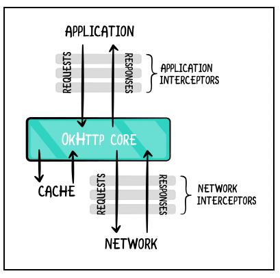

## Mapping data to the domain

```kotlin
interface ApiMapper<E, D> {
    fun mapToDomain(apiEntity: E): D
}
```

Having all the mappers follow this interface gives you the advantage of decoupling
the mapping. This is useful if you have a lot of mappers and want to make sure they
all follow the same contract.

```kotlin
override fun mapToDomain(apiEntity: ApiAnimal):AnimalWithDetails {
    return AnimalWithDetails(
        id = apiEntity.id
        ?: throw MappingException("Animal ID cannot be null"), // 1
        name = apiEntity.name.orEmpty(), // 2
        type = apiEntity.type.orEmpty(),
        details = parseAnimalDetails(apiEntity), // 3
        media = mapMedia(apiEntity),
        tags = apiEntity.tags.orEmpty().map { it.orEmpty() },
        adoptionStatus = parseAdoptionStatus(apiEntity.status),
        publishedAt =
        DateTimeUtils.parse(apiEntity.publishedAt.orEmpty()) //4
)
}
```

1. If the API entity doesn’t have an ID, the code throws a MappingException. You
   need IDs to distinguish between entities, so you want the code to fail if they don’t
   exist.

2. If name in the API entity is null, the code sets the name in the domain entity to
   empty. Should it, though? CanAnimalWithDetails entities have empty names?
   That depends on the domain. In fact, mappers are a good place to search for
   domain constraints. Anyway, for simplicity, assume an empty name is possible.

## Interceptors

OKHttp lets you manipulate your requests and/or responses through interceptors,
which let you monitor, change or even retry API calls.



OkHttp allows two types of interceptors:

- Application interceptors:  Act between your code and OkHttp
- Network interceptors: Act between OkHttp and the server

here are two things to consider about NetworkUnavailableException:

1. It’s modeled as a **domain exception** 

2. It extends IOException. This is where the boundary between the layers starts to
   blur. It extends IOException because Retrofit only handles IOExceptions. So, if
   NetworkUnavailableException extends from any other type, the app is likely to
   crash. This implicitly couples the domain layer to the data layer. If, someday, the
   app stops using Retrofit in favor of a library that handles exceptions differently,
   the domain layer will change as well.

---

```kotlin
 override fun intercept(chain: Interceptor.Chain): Response
```

 Chain is the active chain of interceptors running when the request is ongoing

---

## Ordering the interceptors

```kotlin
OkHttpClient.Builder()
.addInterceptor(A)
.addInterceptor(C)
.addInterceptor(B)
```

The interceptors will run in that order: A → C → B.

---

## Managing API dependencies with Hilt

When you use Hilt, you don’t need to create Dagger components.

Hilt generates a hierarchy of predefined components with corresponding scope
annotations. These components are tied to Android lifecycles. This makes it a lot
easier for you to define the lifetime of your dependencies.

Define the component where you’ll install ApiModule by adding:

```kotlin
@Module
@InstallIn(SingletonComponent::class)
object ApiModule
```

You’re installing the module in SingletonComponent. This component is the
highest in the component hierarchy — all other components descend from it. By
installing ApiModule here, you’re saying that any dependency it provides should live
as long as the app itself. Also, since each child component can access the
dependencies of its parent, you’re ensuring that all other components can access
ApiModule.

### Defining dependencies

- @Inject: Use in class constructors to inject code you own, such as the data mappers.

- @Provides: Use in modules to inject code you don’t own, like any library instance.

- @Binds: Use in modules to inject interface implementations when you don’t need
  initialization code.

### 
